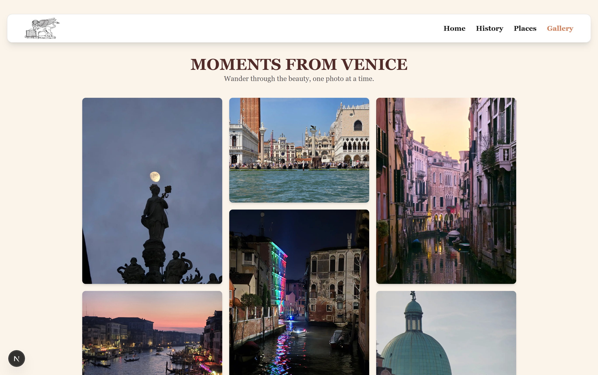

# Visit Venice

Hey there I made this simple multi-page website as a school project and im happy to present it to you. It offers a quick glance of venice showcasing a beautiful gallery, the history of how it came to existence and how it reigned and a page of recommended places to visit.

## Screenshot

## Software used

Next.js with the built-in router
React
Tailwind
Vercel for Deployment

## Link to the website

https://visit-venice.vercel.app
